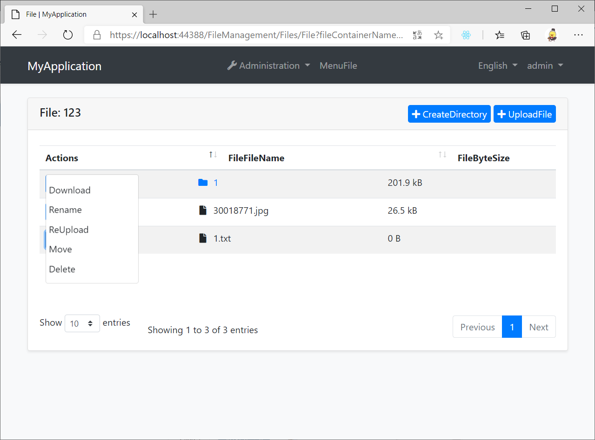
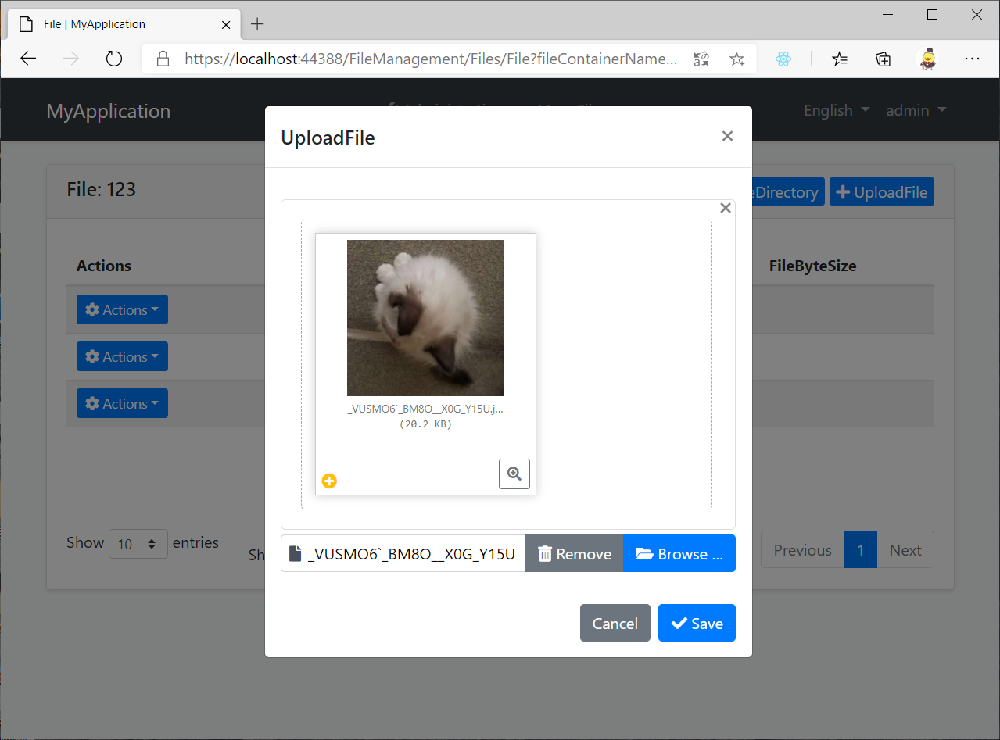

# FileManagement

An abp application module that allows users to upload and manage their own files based on the ABP BLOB storing.

## Getting Started

### Install with [AbpHelper](https://github.com/EasyAbp/AbpHelper.GUI)

* Coming soon.

### Install Manually

1. Install the following NuGet packages. (see how)

    * EasyAbp.FileManagement.Application
    * EasyAbp.FileManagement.Application.Contracts
    * EasyAbp.FileManagement.Domain
    * EasyAbp.FileManagement.Domain.Shared
    * EasyAbp.FileManagement.EntityFrameworkCore
    * EasyAbp.FileManagement.HttpApi
    * EasyAbp.FileManagement.HttpApi.Client
    * (Optional) EasyAbp.FileManagement.MongoDB
    * (Optional) EasyAbp.FileManagement.Web

1. Add `DependsOn(typeof(xxx))` attribute to configure the module dependencies. (see how)

1. Add `builder.ConfigureFileManagement();` to the `OnModelCreating()` method in **MyProjectMigrationsDbContext.cs**.

1. Add EF Core migrations and update your database. See: [ABP document](https://docs.abp.io/en/abp/latest/Tutorials/Part-1?UI=MVC#add-new-migration-update-the-database).

## Usage

1. Add permissions to the roles you want.

1. Configure a BLOB container. (see [sample](host/EasyAbp.FileManagement.Web.Unified/FileManagementWebUnifiedModule.cs#L116-L126) and [doc](https://docs.abp.io/en/abp/latest/Blob-Storing))

1. Configure a file container. (see [sample](host/EasyAbp.FileManagement.Web.Unified/FileManagementWebUnifiedModule.cs#L128-L153))

1. Create a custom **FileOperationAuthorizationHandler**. (see [sample](host/EasyAbp.FileManagement.Web.Unified/CommonContainerFileOperationAuthorizationHandler.cs))

## Road map

- [x] Multi container.
- [x] Multi file upload.
- [x] Upload constraints.
- [x] User-space isolation.
- [x] Reuse existing BLOB resources.
- [x] Directory occupancy statistics.
- [x] Auto deleting unused BLOB resources.
- [x] Auto rename files with duplicate names.
- [ ] Container space quota control.
- [ ] Customized upload way.
- [ ] Complex file search.
- [ ] Unit tests.
